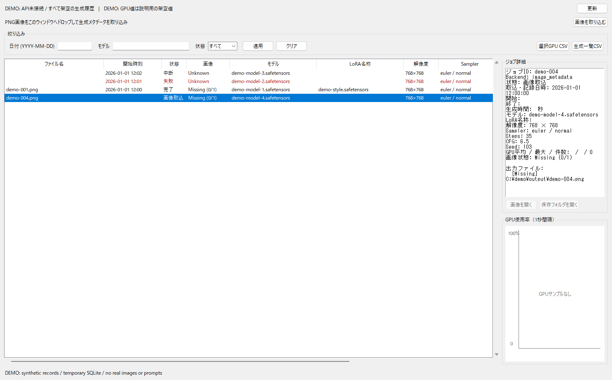
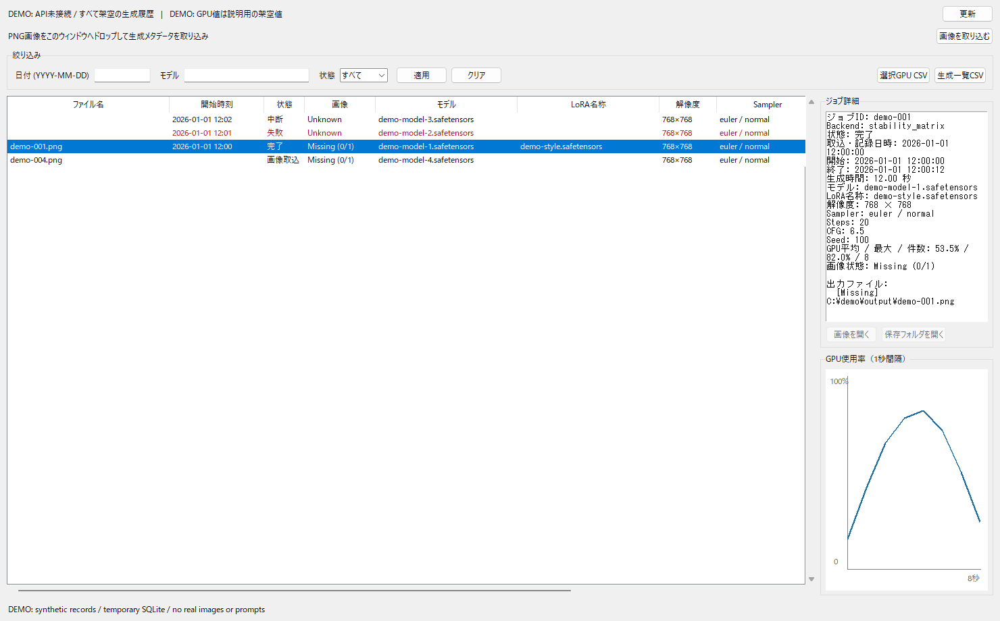

# GenTrace

[日本語 / Japanese](#日本語) | [English](#english)

## 日本語

**既存の生成環境を変更せず、生成ジョブの設定・時間・GPU使用率を手元に残すWindows用ロガー。**

作者はComfyUI等でローカル画像生成を継続する中で、「どの設定で、いつ、どのくらい時間をかけて生成したか」「画像を整理した後でも生成履歴を確認したい」という不便を感じ、自分のためにGenTraceを作りました。日々の生成履歴とメタデータを管理する実用ツールとして育てています。開発にはAIの支援も利用しています。

現在のバージョン: `1.1.1` / [MIT License](LICENSE)



画面は実際のViewerを、架空のモデル・Seed・日時と一時DBで起動して撮影したものです。`C:/demo/` は説明用の存在しない参照先で、Missing表示は意図したものです。個人の生成画像・プロンプトは使用していません。

## 得意なこと

- Stability MatrixのComfyUIを読み取り専用で監視し、成功・失敗・中断をSQLiteに保存。
- 約1秒間隔のGPU Engine使用率、生成秒数、モデル、LoRA名称、寸法、Sampler、Scheduler、Steps、CFG、Seedを一つのジョブ履歴として確認。
- LoggerとViewerが独立動作。Viewerを閉じても通知領域のLoggerは記録を継続。
- PNGをドロップ・選択して、取得できる設定だけを後から登録。本文やworkflow全文をDBに保存しない。
- 画像本体をコピーせず絶対パスを参照。画像が消えても履歴とファイル名を保持。
- 日付・状態・モデル名で絞り込み、CSVへ出力。追加のpipパッケージやcustom nodeは不要。

SQLite保存、PNG解析、LoRA抽出、ローカル動作は他の優れたツールにもあります。GenTraceはこの構成での履歴記録に重点を置いています。画像ギャラリー、プロンプト全文検索、workflow復元、content hashでの重複画像整理が必要なら [競合比較](docs/competition.md) の代替ツールも検討してください。「世界唯一」「任意のComfyUI workflow完全対応」「個人情報が一切保存されない」とは主張しません。

## インストール

対象はWindows 10/11と、Python 3.11以上のTkinter・SQLite付き環境です。この公開準備ではWindows / Python 3.11.9で検証しました。GitHub ActionsのWindows環境でもPython 3.11・3.14のテストと公開監査が合格しています。

1. Pythonを [python.org](https://www.python.org/downloads/windows/) からインストールし、PATHとTcl/Tkを有効にします。Stability Matrixの内部Pythonとは別の、`python` / `pythonw`で起動できる環境を使用します。
2. 公開ソースZIPを任意の書き込み可能なフォルダへ展開します。PythonやモデルのダウンロードはGenTraceに含みません。
3. GenTraceフォルダをPowerShellで開き、次を確認します。

```powershell
python --version
python -c "import tkinter, sqlite3; print(tkinter.TkVersion, sqlite3.sqlite_version)"
```

4. Stability MatrixがGenTraceの隣の `StabilityMatrix` フォルダにない場合、`config.example.json`を `config.local.json` へコピーし、`stability_root` を自分のStability Matrixインストール先へ変更します。末尾の `Data` は付けません。JSONでは `/` か `\\` を使います。

```json
{
  "stability_root": "C:/example/StabilityMatrix"
}
```

実際のパスを書いた `config.local.json` はGit管理対象外です。設定優先順は関数への明示指定 → 環境変数 `GENTRACE_STABILITY_ROOT` → ローカル設定 → GenTraceの隣のStabilityMatrixです。`.env`の自動読込みは行いません。

5. Stability MatrixでComfyUIを起動し、GenTraceで利用するパッケージをアクティブにします。API host / portは `Data/settings.json` のLaunchArgsから読み取ります。`/api/jobs`・`/api/jobs/{id}`・`/queue`が必要です。古いComfyUIや他の起動形態をすべてサポートするものではありません。
6. `GenTrace.vbs`をダブルクリックするか、次のコマンドで起動します。

```powershell
python main.py
```

ダブルクリック起動で何も表示されない場合は `run_console.cmd` または上記のコンソール起動でエラーを確認します。WindowsでVBScriptが無効な環境でもPythonから起動できます。Stability Matrixの設定ファイル・ComfyUI・画像には書き込みません。

## 操作

- 個別起動: `python main.py --logger` / `python main.py --viewer`。それぞれ専用のVBSもあります。
- Viewerの閉じるボタンはViewerだけを終了。Loggerは通知領域アイコンの右クリック → `終了`で止めます。
- 日付は `YYYY-MM-DD`。モデルは名前の部分一致。状態を選んで `適用`。自動更新は最後に適用した条件を使い、日付入力中にエラーを出しません。
- 一覧先頭はファイル名。列境界をダブルクリックして幅調整。画面外の列は下の横スクロールで表示します。
- 行を選ぶと生成設定とGPUグラフを表示。`Present`は全参照先あり、`Missing`は一部または全部が参照できない、`Unknown`はパス未記録です。読み取り権限がない画像もMissingになりえます。
- 残存画像を既定アプリで開くか、保存フォルダをExplorerで開けます。
- `画像を取り込む`またはPNGをドロップして取込。同じ絶対パスは既存の空欄だけを補完し、異なるパスの同一画像は別件です。壊れたファイルはスキップし、他の正常ファイルは続けます。
- 手動取込では生成日時・秒数・GPUを推測しません。日付絞り込みの対象外です。一覧は最大1000ジョブです。



GPU値は説明用の架空値です。実採取は、選択physical indexのGPUアダプター全体に対する最も忙しいengineの値で、ComfyUI専用の使用率ではありません。他プロセスの負荷も含まれます。

## 保存とプライバシー

| 保存物 | 場所・内容 |
|---|---|
| DB | `data/gentrace.db`。設定、ジョブID、日時、GPU、絶対画像パス |
| 移行前バックアップ | `data/backups/`。Online Backup APIによる非公開の `.bak` |
| CSV | `exports/` 内のみ。生成一覧と選択GPUサンプル、UTF-8 BOM。生成CSVの出力パス列には絶対パスを含む |
| 診断ログ | `logs/gentrace.log`。1 MiB・2世代。例外やパスを含むことがある |

本文を保存しない設計でも、DB・CSV・ログ・ローカル設定・本物のPNGは個人情報を含みえます。ファイル名やモデル名に個人情報がある場合も保存されます。これらをGitHubや公開issueへ添付しないでください。[安全な取り扱い](SECURITY.md)

自動起動・サービス・レジストリ変更はありません。アンインストールはLoggerとViewerを終了し、必要なDBを非公開の場所にバックアップしてからGenTraceフォルダを削除します。画像本体は外部に残ります。

## メタデータ・DB・エラー

- [対応メタデータ一覧と非対応項目](docs/metadata.md)
- [DBスキーマ4・旧版移行・復旧方法](docs/database.md)
- [競合比較と主張の根拠](docs/competition.md)
- [公開前チェックリストと履歴の扱い](docs/publication.md)
- [依存関係とライセンス](THIRD_PARTY_NOTICES.md)

起動時に設定がない・JSONが壊れている場合は設定を案内します。DBロック・破損・権限不足はエラーとして扱い、DBを自動削除しません。PNGの切断・テキストCRC・過大な圧縮メタデータを検査し、未知メタデータはスキップします。長いパスや消失ファイルのエラーも個別に処理しますが、Windowsのすべての長いパス・ネットワーク共有を保証しません。

Loggerを止めていた間の履歴や、ComfyUIから消えたジョブを完全に回収する保証はありません。PNGによる出力照合が同一設定・同時間帯で曖昧になる場合もあります。大量ライブラリの性能・全custom node・全GPU構成は未検証です。

## デモと開発検証

実データ・Stability Matrix・APIを使わず画面を確認できます。

```powershell
python scripts/demo.py
```

通常の検証:

```powershell
$env:PYTHONUTF8 = "1"
.\run_tests.cmd
python scripts/publication_audit.py
```

テストは一時DB、架空PNG、模擬HTTP、WindowsのTkドロップ通知を使います。実際の新規画像生成による検証とは別です。`diagnose.py`は設定検出とDB初期化を行うため、読み取り専用監査には使わないでください。[開発資料](docs/development.md)

## バージョン規則

`x.y.z`で、互換性破壊はx、互換性を保った機能追加はy、小規模改修・修正はzを更新します。一連の改修につき一度、最も大きい区分を採用し、`VERSION`・`gentrace.__version__`・README・CHANGELOGを揃えます。コミットや公開は明示的に依頼された場合に行います。

---

## English

[日本語 / Japanese](#日本語)

**A Windows logger that keeps generation settings, timings, and GPU utilization locally without changing your existing generation setup.**

The author continues to generate images locally with tools such as ComfyUI. GenTrace grew out of practical frustrations: remembering which settings were used, when a job ran, how long it took, and finding that history after organizing the images. It is a tool built for the author's own ongoing generation and metadata management needs. AI assistance is also used during development.

Current version: `1.1.1` / [MIT License](LICENSE)


This is the actual Viewer running against a temporary database with fictional models, seeds, and dates. `C:/demo/` is a fictional reference path; the Missing status is intentional. No personal generated images or real prompts are used.

### What GenTrace does

- Observes ComfyUI managed by Stability Matrix in a read-only manner and stores successful, failed, and interrupted jobs in SQLite.
- Shows GPU Engine utilization sampled approximately once per second alongside generation duration, model, LoRA names, dimensions, sampler, scheduler, steps, CFG, and seed for each job.
- Runs Logger and Viewer independently. Closing Viewer leaves Logger recording in the notification area.
- Imports available settings from dropped or selected PNG files. Prompt text and complete workflows are not stored in the database.
- References images by absolute path without copying them. History and filenames remain when images disappear.
- Filters by date, status, and model name and exports CSV. No additional pip packages or custom nodes are required.

SQLite storage, PNG parsing, LoRA extraction, and local operation are also available in other capable tools. GenTrace focuses on recording history in this particular setup. For image galleries, full prompt search, workflow reconstruction, or content-hash deduplication, see the alternatives in the [competition comparison (Japanese)](docs/competition.md). GenTrace does not claim to be the only tool of its kind, to support every ComfyUI workflow, or to store no personal information.

### Installation

Requirements: Windows 10/11 and Python 3.11 or later with Tkinter and SQLite. Local verification used Windows / Python 3.11.9. Tests and publication audits also passed on Windows with Python 3.11 and 3.14 in GitHub Actions.

1. Install Python from [python.org](https://www.python.org/downloads/windows/), enabling PATH and Tcl/Tk. Use a Python installation that can launch `python` and `pythonw`, separate from Stability Matrix's internal Python.
2. Extract the public source ZIP into a writable folder. GenTrace does not include Python or model downloads. On GitHub, use **Code → Download ZIP**.
3. Open PowerShell in the GenTrace folder and check:

   ```powershell
   python --version
   python -c "import tkinter, sqlite3; print(tkinter.TkVersion, sqlite3.sqlite_version)"
   ```

4. If Stability Matrix is not in a sibling folder named `StabilityMatrix`, copy `config.example.json` to `config.local.json` and set `stability_root` to your Stability Matrix installation folder. Do not append `Data`. Use `/` or `\\` in JSON paths.

   ```json
   {
     "stability_root": "C:/example/StabilityMatrix"
   }
   ```

   `config.local.json`, which contains your actual path, is excluded from Git. Configuration priority is: explicit function argument → `GENTRACE_STABILITY_ROOT` environment variable → local configuration → sibling StabilityMatrix folder. `.env` files are not loaded automatically.

5. Start ComfyUI through Stability Matrix and activate the package you want GenTrace to observe. API host and port are read from LaunchArgs in `Data/settings.json`. The `/api/jobs`, `/api/jobs/{id}`, and `/queue` endpoints are required. Older ComfyUI versions and all other launch configurations are not universally supported.
6. Double-click `GenTrace.vbs`, or run:

   ```powershell
   python main.py
   ```

If nothing appears after double-clicking, use `run_console.cmd` or the console command above to inspect the error. Python launching works even when VBScript is disabled on Windows. GenTrace does not write to Stability Matrix settings, ComfyUI, or image files.

### Using GenTrace

The application UI currently uses Japanese labels; this bilingual README does not change the UI language.

- Launch separately with `python main.py --logger` or `python main.py --viewer`. Dedicated VBS launchers are also included.
- Closing Viewer stops only Viewer. To stop Logger, right-click its notification-area icon and choose `終了` (Exit).
- Dates use `YYYY-MM-DD`. Model filtering matches part of the name. Choose a status and click `適用` (Apply). Automatic refresh uses the last applied filters, so editing a date does not trigger validation errors mid-entry.
- The first column shows the filename. Double-click a column boundary to adjust its width. Use the bottom horizontal scrollbar to reach columns outside the window.
- Select a row to see generation settings and the GPU graph. `Present` means all referenced images are available; `Missing` means some or all cannot be accessed; `Unknown` means no paths were recorded. Images without read permission may also appear as Missing.
- Open an available image in its default application or open its folder in Explorer.
- Click `画像を取り込む` (Import images) or drop PNG files onto Viewer. For an already recorded absolute path, only empty fields are filled. Identical images at different paths are separate records. Invalid files are skipped while valid files continue to import.
- Manual import does not infer generation date, duration, or GPU utilization. These records are excluded by date filters. The list displays at most 1,000 jobs.


The GPU samples shown here are fictional. Real samples represent the busiest engine on the GPU adapter selected by physical index. They are not specific to ComfyUI and include activity from other processes.

### Storage and privacy

| Stored data | Location and contents |
|---|---|
| Database | `data/gentrace.db`: settings, job IDs, dates, GPU samples, and absolute image paths |
| Pre-migration backups | Private `.bak` files in `data/backups/`, created with the SQLite Online Backup API |
| CSV | Only within `exports/`: generation lists and selected GPU samples, UTF-8 with BOM. Generation CSV path columns include absolute paths |
| Diagnostic logs | `logs/gentrace.log`: 1 MiB with two rotated backups; may include exceptions and paths |

Even though prompt text is not stored, databases, CSV files, logs, local configuration, and actual PNG files may contain personal information. Personal information in filenames or model names can also be stored. Do not attach these files to GitHub or public issues. See [safe handling (Japanese)](SECURITY.md).

GenTrace does not configure automatic startup, services, or registry settings. To uninstall, stop Logger and Viewer, back up any database you need to a private location, and delete the GenTrace folder. Externally stored images remain in place.

### Metadata, database, and errors

The detailed reference documents below are currently in Japanese:

- [Supported metadata and unsupported fields](docs/metadata.md)
- [Database schema 4, upgrades, and recovery](docs/database.md)
- [Competition comparison and evidence for claims](docs/competition.md)
- [Publication checklist and history handling](docs/publication.md)
- [Dependencies and licenses](THIRD_PARTY_NOTICES.md)

Missing configuration or invalid JSON at startup produces configuration guidance. Database locks, corruption, and insufficient permissions are treated as errors; the database is not automatically deleted. PNG truncation, text-chunk CRC, and oversized compressed metadata are checked, and unknown metadata is skipped. Long-path and missing-file errors are handled individually, but support for every Windows long path or network share is not guaranteed.

History from periods when Logger was stopped, or jobs removed from ComfyUI, cannot be guaranteed recoverable. Matching PNG outputs to jobs can be ambiguous when settings and timestamps overlap. Large libraries, every custom node, and every GPU configuration have not been validated.

### Demo and development checks

Inspect the UI without real data, Stability Matrix, or API access:

```powershell
python scripts/demo.py
```

Normal verification:

```powershell
$env:PYTHONUTF8 = "1"
.\run_tests.cmd
python scripts/publication_audit.py
```

Tests use temporary databases, synthetic PNGs, mock HTTP, and Windows Tk file-drop notifications. They are distinct from verification using a new real generation job. `diagnose.py` detects configuration and initializes the database, so do not use it for a read-only audit. See the [development guide (Japanese)](docs/development.md).

### Versioning

GenTrace uses `x.y.z`: x for breaking changes, y for compatible features, and z for small revisions or fixes. Each set of changes increments the version once, using the largest applicable category, and keeps `VERSION`, `gentrace.__version__`, README, and CHANGELOG consistent. Commits and publication are performed when explicitly requested.
